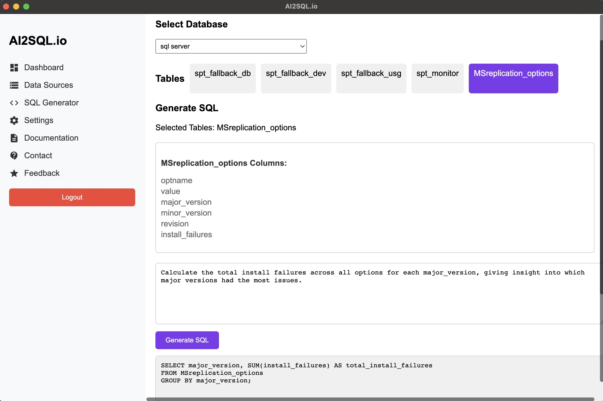

# AI2SQL Desktop

AI2SQL Desktop is an AI-powered SQL query generator that helps developers and database administrators generate SQL queries using natural language. This desktop application supports both MySQL and Microsoft SQL Server databases.

## Features

- 🤖 AI-powered SQL query generation
- 🔄 Support for MySQL, SQL Server and PostgreSQL
- 💾 Local database connection management
- ⚡ Real-time query execution
- 🔒 Secure credential storage
- 🔄 Automatic updates
- 📊 Usage analytics

## Installation

### Windows
1. Download the latest version from [Releases](https://github.com/mergisi/ai2sql-desktop/releases)
2. Run the installer (`AI2SQL-Generator-Setup-x.x.x.exe`)
3. Follow the installation wizard

### macOS
1. Download the latest version from [Releases](https://github.com/mergisi/ai2sql-desktop/releases)
2. Open the DMG file (`AI2SQL-Generator-x.x.x.dmg`)
3. Drag the application to your Applications folder

## Quick Start

1. **Login/Register**
   - Use your web.ai2sql.io credentials
   - Don't have an account? [Sign up here](https://web.ai2sql.io/signup)

2. **Connect to Database**
   - Go to "Data Sources"
   - Click "Add Connection"
   - Fill in your database credentials
   - Test the connection

3. **Generate SQL**
   - Select your database
   - Choose the tables
   - Enter your query request in natural language
   - Click "Generate SQL"

4. **Execute Queries**
   - Review the generated SQL
   - Click "Execute" to run the query
   - View results in the table below

## System Requirements

- **Windows**: Windows 10 or later
- **macOS**: macOS 10.13 or later
- **Memory**: 4 GB RAM minimum
- **Storage**: 200 MB available space
- **Internet**: Required for AI functionality

## Updates

The application automatically checks for updates on startup. You can also manually check for updates:
1. Go to Dashboard
2. Click "Check for Updates"
3. If available, download and install the new version

## Security

- Database credentials are securely stored locally
- No database data is sent to our servers
- Only query structures are processed by AI
- All communications are encrypted

## Troubleshooting

### Common Issues

1. **Connection Failed**
   - Check database credentials
   - Verify database server is accessible
   - Check firewall settings

2. **SQL Generation Failed**
   - Ensure tables are selected
   - Check internet connection
   - Verify query request is clear

3. **Update Issues**
   - Check internet connection
   - Try downloading manually from releases page
   - Run as administrator (Windows)

## Support

- [Documentation]([https://docs.ai2sql.io](https://ai2sql.gitbook.io/))
- [Email Support](mailto:support@ai2sql.io)
- [Issue Tracker](https://github.com/mergisi/ai2sql-desktop/issues)

## License

This project is licensed under the ISC License - see the [LICENSE](LICENSE) file for details.

## Changelog

### [1.1.1] - 2024-03-15
- Added version checker
- Improved error handling
- Fixed database connection issues
- Enhanced SQL query generation

### [1.0.9] - 2024-03-01
- Initial release
- Basic SQL generation
- Database connection management
- Query execution

## About

AI2SQL Desktop is developed and maintained by AI2sql. For more information, visit [httpai2sql.io](https://ai2sql.io/).

---

Made with ❤️ by AI2SQL Team
